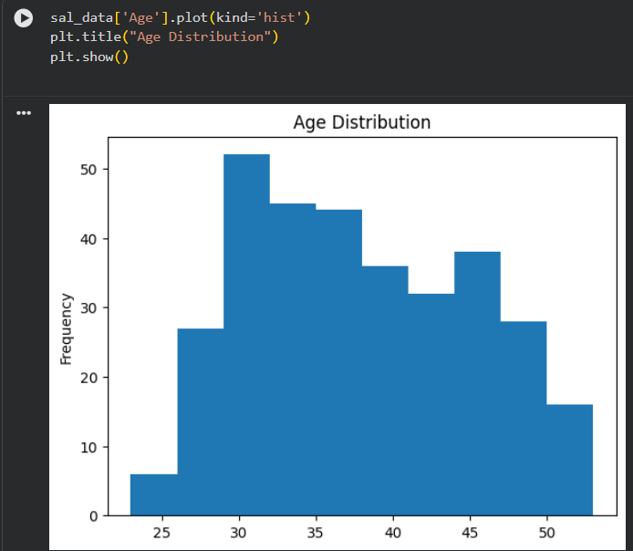
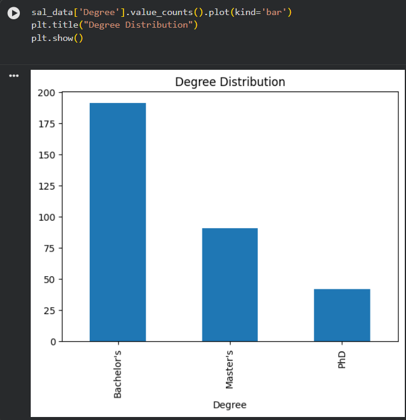
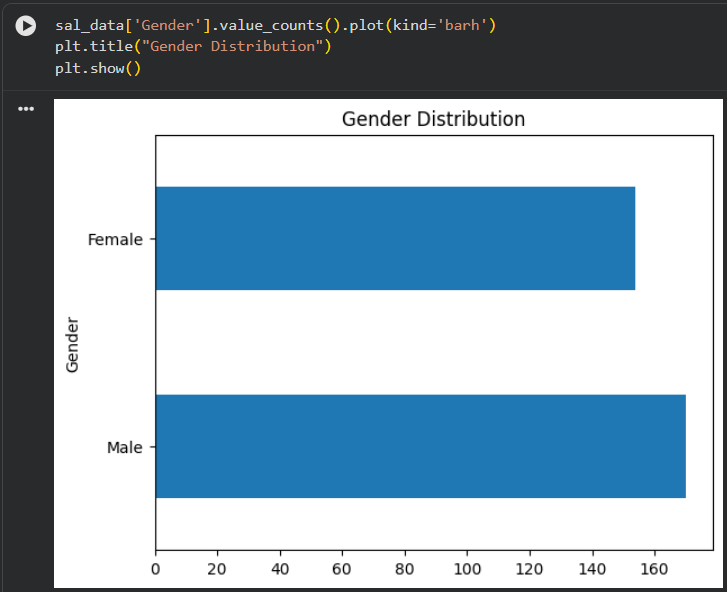
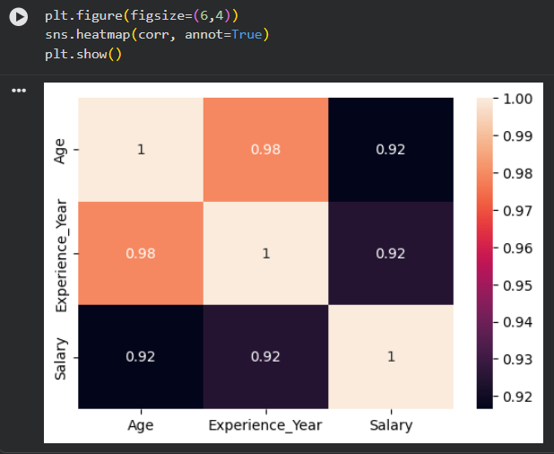

# salary-prediction-ML
Salary Prediction using Machine Learning

 Project Overview

This project aims to predict the salary of an employee based on various attributes such as Age, Gender, Education Degree, Job Title, and Years of Experience using Machine Learning regression algorithms.

The project demonstrates a complete machine learning workflow, including data preprocessing, exploratory data analysis (EDA), model training, evaluation, and prediction.

Multiple regression models were implemented and compared to identify the most accurate model for salary prediction.

---

 Objectives

- Analyze employee salary data.
- Perform data preprocessing and cleaning.
- Conduct exploratory data analysis to understand data patterns.
- Train multiple regression models.
- Compare model performance.
- Predict salary using machine learning.

---

 Dataset Description

The dataset contains employee information used for predicting salary.

Dataset Features

Feature| Description
Age| Age of the employee
Gender| Gender of the employee
Degree| Educational qualification
Job_Title| Job role of the employee
Experience_Year| Number of years of experience
Salary| Salary of the employee (Target Variable)

---

 Technologies Used

- Python
- Pandas
- NumPy
- Matplotlib
- Seaborn
- Scikit-learn
- Jupyter Notebook / Google Colab

---

 Machine Learning Workflow

1. Data Collection
2. Data Cleaning
3. Exploratory Data Analysis
4. Data Encoding
5. Feature Scaling
6. Train-Test Split
7. Model Training
8. Model Evaluation
9. Model Comparison
10. Salary Prediction

---

 Exploratory Data Analysis

Different visualizations were created to understand the dataset.

Age Distribution

Degree Distribution

Gender Distribution

Correlation Heatmap

---

 Machine Learning Models Used

The following regression models were implemented:

Linear Regression

A basic regression model used as a baseline algorithm.

Decision Tree Regression

A tree-based model that captures nonlinear relationships in the dataset.

Random Forest Regression

An ensemble learning model that combines multiple decision trees to improve prediction accuracy.

---

 Model Evaluation

Models were evaluated using the following metrics:

- R² Score
- Mean Absolute Error (MAE)
- Root Mean Squared Error (RMSE)

Model Comparison

(Add screenshot of model comparison table or graph)

"Model Comparison" (images/model_comparison.png)

---

 Salary Prediction Example

The trained model can predict salary based on input attributes.

Example input:

- Age = 49
- Gender = Male
- Degree = Master
- Experience = 15 years

The model predicts the expected salary for the employee.

(Add screenshot of prediction output)

"Prediction Output" (images/prediction_output.png)

---

 Project Structure

Salary-Prediction-ML
│
├── salary_prediction.ipynb
├── Salary Data.csv
├── salary_model.pkl
├── README.md
└── images
     ├── age_histogram.png
     ├── degree_distribution.png
     ├── gender_distribution.png
     ├── heatmap.png
     ├── model_comparison.png
     └── prediction_output.png

---

 How to Run the Project

1. Clone the repository

git clone https://github.com/yourusername/Salary-Prediction-ML.git

2. Open the notebook

salary_prediction.ipynb

3. Run all cells to train models and generate predictions.

---

 Key Learnings

- Data preprocessing techniques
- Exploratory Data Analysis
- Feature encoding and scaling
- Regression algorithms
- Model evaluation methods
- Machine learning workflow

---

 Future Improvements

- Add more features such as skills and company location.
- Use advanced algorithms like XGBoost.
- Deploy the model as a web application.
- Build a real-time salary prediction system.

---

 Author

Dikshit Chaudhary
Machine Learning Project

---

 If you found this project useful, consider giving it a star on GitHub.
